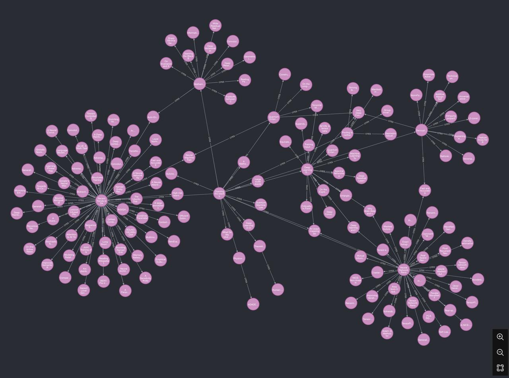

# 📚 ArXiv Citation Scraper and Graph Builder

This project automates the extraction of citation data from arXiv articles and organizes it into a **Neo4j graph database**. Starting from a given article, the tool retrieves metadata, processes PDFs to extract referenced articles, and builds a graph where nodes represent papers and edges represent citation relationships. The graph can be recursively expanded by following references.

---

## 🚀 Project Overview

### Features:
1. **Fetch Metadata**: Retrieve metadata (title, authors, publication date) for any arXiv article using its ID.
2. **PDF Parsing**: Extract referenced articles from an article’s PDF.
3. **Citation Graph**: Build a Neo4j graph database with papers as nodes and citations as edges.
4. **Recursive Crawling**: Expand the graph by recursively exploring references.

### Example Use Case:
Starting with the article "Attention Is All You Need" (arXiv:1706.03762), the tool:
- Fetches metadata for the article.
- Extracts references from its PDF.
- Stores the article and its references in a Neo4j graph database.
- Recursively explores the references to grow the graph.

---

## 🌐 Graph Visualization

Below is an example visualization of the graph database generated by this project:

---

## 📂 Project Structure

- **`fetchArticleMetadata.py`**: Fetches metadata for an arXiv paper using its ID.
- **`processPdf.py`**: Extracts text from a paper’s PDF and processes it for references.
- **`getReferencesArticles.py`**: Identifies referenced arXiv articles using regex patterns.
- **`testNeo4jConnection.py`**: Tests the connection to the Neo4j graph database.
- **`saveIdToGraphDb.py`**: Saves articles and their references as nodes and relationships in Neo4j.
- **`recursiveCrawler.py`**: Automates recursive exploration of citations to expand the graph.
- **`papersWithCode.py`**: Fetches additional metadata like code repositories (optional).
- **`utils.py`**: Helper functions for common tasks like API requests and logging.

This project was done in collaboration with **Solomon Harvey** and **Matthieu Neau**.
